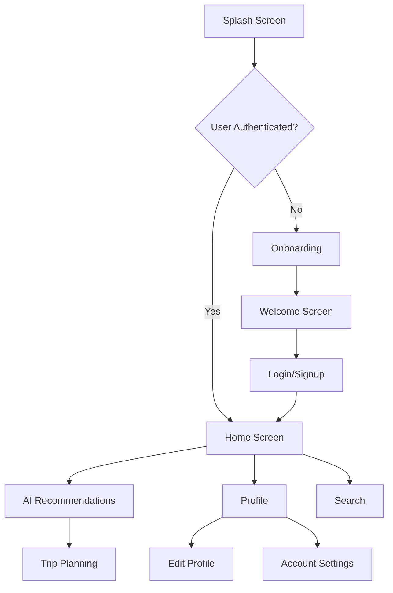

# Rahhala App

A modern travel companion Flutter application that provides personalized AI-powered travel recommendations with a premium Material 3 design.

## 📱 Screenshots

<p align="center">
  
  
  
  
</p>

<p align="center">
  
  
  
  
</p>

<p align="center">
  
  
  
  
</p>

<p align="center">
  
  
</p>

## 🌟 Features

- **AI-Powered Travel Recommendations** 🤖 - Personalized travel plans based on your preferences and budget
- **Modern Authentication System** 🔐 - Secure login and registration with email verification
- **User Profile Management** 👤 - Complete profile editing and account management
- **Interactive Onboarding** 🎯 - Guided introduction for new users
- **Material 3 Design** 🎨 - Premium, modern UI with adaptive theming
- **Cross-Platform Support** 📱 - Runs on Android, iOS, Web, and Desktop
- **Responsive Layout** 📐 - Adapts beautifully to all screen sizes
- **Clean Architecture** 🏗️ - Well-organized, maintainable codebase

<p align="center">
  
</p>

## 🛠️ Technologies & Packages

### Core Technologies
- **[Flutter 3.3.0+](https://flutter.dev)** - Cross-platform UI toolkit
- **[Dart 3.0+](https://dart.dev)** - Programming language
- **[Material 3](https://m3.material.io)** - Design system

### Key Packages
- **[flutter_bloc](https://pub.dev/packages/flutter_bloc)** - State management
- **[get_it](https://pub.dev/packages/get_it)** - Dependency injection
- **[dio](https://pub.dev/packages/dio)** - HTTP client
- **[go_router](https://pub.dev/packages/go_router)** - Navigation and routing
- **[flutter_screenutil](https://pub.dev/packages/flutter_screenutil)** - Responsive design
- **[shared_preferences](https://pub.dev/packages/shared_preferences)** - Local storage
- **[image_picker](https://pub.dev/packages/image_picker)** - Image selection
- **[dartz](https://pub.dev/packages/dartz)** - Functional programming utilities
- **[equatable](https://pub.dev/packages/equatable)** - Value equality

## 🏗️ Architecture

The Rahhala App follows **Clean Architecture** principles with a **feature-first** organization:

```
lib/
├── main.dart
├── core/                         # Shared logic and cross-cutting concerns
│   ├── components/               # Reusable UI components
│   ├── constants/                # App-wide constants
│   ├── di/                       # Dependency injection
│   ├── errors/                   # Error handling
│   ├── network/                  # API layer
│   ├── routing/                  # App routing
│   ├── theme/                    # Theming
│   ├── utils/                    # Utility functions
│   └── widgets/                  # Shared widgets
└── features/                     # Feature modules
    ├── ai_recommendation/        # AI travel recommendations
    │   ├── data/                 # Data sources and repositories
    │   ├── domain/               # Business logic and use cases
    │   └── presentation/         # UI and presentation logic
    ├── auth/                     # Authentication
    ├── home/                     # Home screen
    ├── onboarding/               # User onboarding
    ├── profile/                  # User profile
    └── splash/                   # Splash screen
```

### Architecture Layers

1. **Presentation Layer** - UI components and screens
2. **Domain Layer** - Business logic, use cases, and entities
3. **Data Layer** - Repositories, data sources, and models
4. **Core Layer** - Shared utilities and cross-cutting concerns

## 🔄 App Flow



## 🎨 UI/UX Design

### Design System

The Rahhala App implements a comprehensive design system based on Material 3 principles:

**Color Palette**
- Primary: `#CDAE8A` (Gold/Bronze accent)
- Secondary: `#36454F` (Charcoal)
- Surface: `#FFFFFF` (White)
- Background: `#F8F9FA` (Light gray)
- Error: `#B00020` (Red)

**Typography**
- Display: Large, medium, and small headings
- Headline: Prominent section titles
- Title: Subheadings and card titles
- Body: Main content text
- Label: Button and input labels

**Component Library**
- PrimaryButton - Consistent action buttons
- AppTextField - Standardized input fields
- AppCard - Elevated content containers
- AppAppBar - Customizable app bars
- EmailTextField & PasswordTextField - Pre-validated form fields

## 📱 Responsive Design

Rahhala App is designed to work seamlessly across all platforms:

- **Mobile**: Optimized touch interactions and layouts
- **Tablet**: Adaptive grid layouts and larger touch targets
- **Web**: Desktop-friendly navigation and keyboard support
- **Desktop**: Native window management and keyboard shortcuts

## 🚀 Getting Started

### Prerequisites

- [Flutter SDK](https://flutter.dev/docs/get-started/install) (version 3.3.0 or higher)
- [Dart SDK](https://dart.dev/get-dart) (comes with Flutter)
- [Android Studio](https://developer.android.com/studio) or [Xcode](https://developer.apple.com/xcode/) for mobile development
- [Visual Studio Code](https://code.visualstudio.com/) or [Android Studio](https://developer.android.com/studio) with Flutter and Dart plugins

### Installation

1. Clone the repository:
   ```bash
   git clone https://github.com/your-username/rahhala_app.git
   ```

2. Navigate to the project directory:
   ```bash
   cd rahhala_app
   ```

3. Install dependencies:
   ```bash
   flutter pub get
   ```

4. Run the app:
   ```bash
   flutter run
   ```

### Development Setup

```bash
# Analyze the code
flutter analyze

# Run tests
flutter test

# Format code
flutter format .
```

### Building for Production

- **Android APK**:
  ```bash
  flutter build apk --release
  ```

- **Android App Bundle**:
  ```bash
  flutter build appbundle --release
  ```

- **iOS**:
  ```bash
  flutter build ios --release
  ```

- **Web**:
  ```bash
  flutter build web --release
  ```

- **Windows**:
  ```bash
  flutter build windows --release
  ```

- **macOS**:
  ```bash
  flutter build macos --release
  ```

- **Linux**:
  ```bash
  flutter build linux --release
  ```

## 📁 Project Structure

The project follows a **feature-first architecture** with clean separation of concerns:

```
lib/
├── main.dart                     # Application entry point
├── core/                         # Shared infrastructure
│   ├── components/               # Reusable UI components
│   ├── constants/                # App-wide constants and configuration
│   ├── di/                       # Dependency injection setup
│   ├── errors/                   # Error handling and exceptions
│   ├── network/                  # API client and network layer
│   ├── routing/                  # Navigation and routing
│   ├── theme/                    # Theming and design system
│   ├── utils/                    # Utility functions and helpers
│   └── widgets/                  # Shared widgets
└── features/                     # Feature modules
    ├── ai_recommendation/        # AI-powered travel recommendations
    ├── auth/                     # Authentication system
    ├── home/                     # Home screen and main navigation
    ├── onboarding/               # User onboarding flow
    ├── profile/                  # User profile management
    └── splash/                   # Initial splash screen
```

## 🧪 Testing

```bash
# Run all tests
flutter test

# Run tests with coverage
flutter test --coverage

# Run specific test file
flutter test test/widget_test.dart
```

## 🔐 Backend / API Integration

The Rahhala App integrates with a backend API for:

- User authentication and authorization
- Profile management
- AI-powered travel recommendations
- Trip planning and saving

**API Endpoints**:
- `/api/auth/login` - User login
- `/api/auth/register` - User registration
- `/api/auth/forgot-password` - Password reset
- `/api/user/profile` - User profile operations
- `/api/travel/recommendations` - AI travel suggestions

## 🤝 Contributing

We welcome contributions to the Rahhala App! Here's how you can help:

1. Fork the repository
2. Create a feature branch (`git checkout -b feature/amazing-feature`)
3. Commit your changes (`git commit -m 'Add amazing feature'`)
4. Push to the branch (`git push origin feature/amazing-feature`)
5. Open a Pull Request

### Development Guidelines

- Follow [Effective Dart](https://dart.dev/guides/language/effective-dart) guidelines
- Use descriptive commit messages
- Write meaningful variable and function names
- Keep functions small and focused (< 50 lines)
- Add documentation for public APIs
- Run `flutter analyze` and fix all issues
- Write tests for new functionality

### Code Style

```bash
# Format code automatically
flutter format .

# Analyze code quality
flutter analyze
```

## 📄 License

This project is licensed under the MIT License. See the [LICENSE](LICENSE) file for details.

## 🙏 Acknowledgments

- [Flutter Team](https://flutter.dev) for the amazing framework
- [Material Design](https://material.io) for the design system
- All contributors who have helped improve Rahhala App
- Inspiration from modern travel applications and AI technologies

## 📞 Support

- **Issues**: [GitHub Issues](https://github.com/your-username/rahhala_app/issues)
- **Documentation**: [Wiki](https://github.com/your-username/rahhala_app/wiki)
- **Discussions**: [GitHub Discussions](https://github.com/your-username/rahhala_app/discussions)

## 🌟 Star History

[](https://star-history.com/#your-username/rahhala_app&Date)

---

<p align="center">
  Made with ❤️ using Flutter
</p>