# Rahhala App

Rahhala is a Flutter travel companion app for discovering places, planning trips, getting AI-assisted recommendations, searching by image, browsing nearby places, and managing saved trips and profile settings.

The current app is built as a feature-first Flutter project using Cubit/BLoC, GetIt dependency injection, Dio networking, GoRouter routing, secure token storage, Arabic/English localization, and light/dark themes.

## Current Status

- App name: `Rahhala`
- Version: `1.0.0+1`
- Default flavor: `production`
- Supported languages: Arabic and English
- Supported theme modes: light and dark
- Main API base URL: `https://rahhallaweb2026.runasp.net`
- Chatbot API base URL: `https://express-js-on-vercel-ten-roan-21.vercel.app`

## Screenshots

<p align="center">
  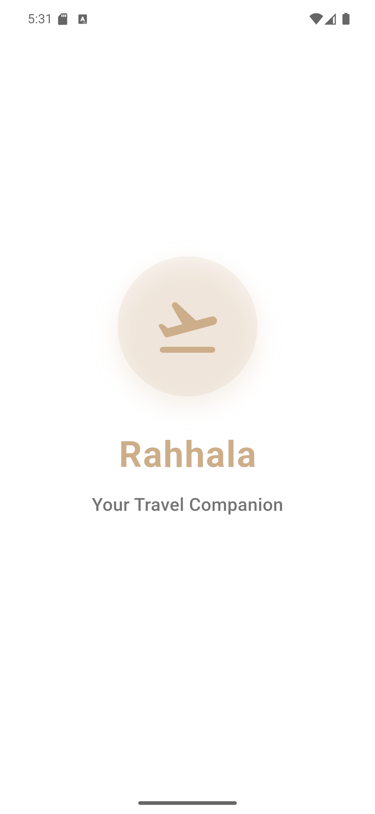
  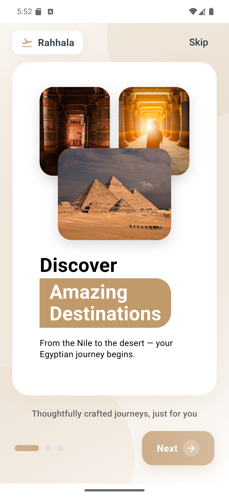
  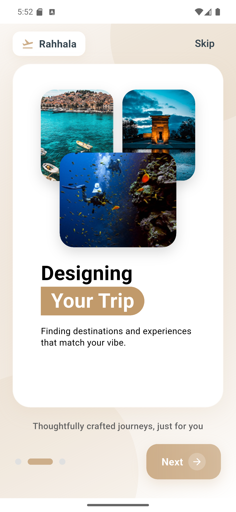
  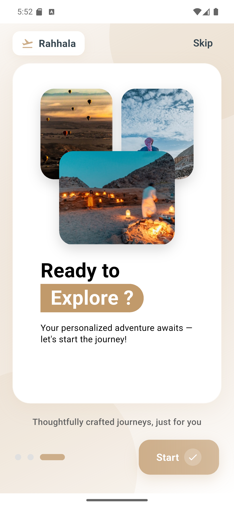
</p>

<p align="center">
  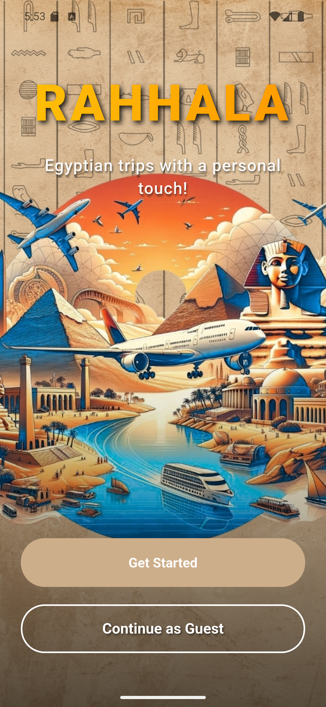
  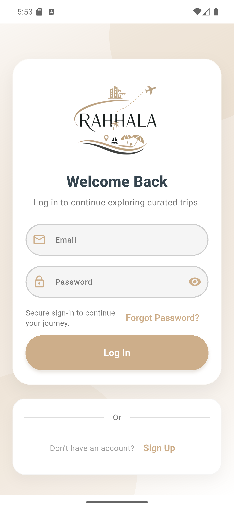
  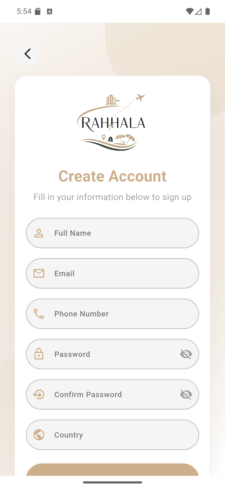
  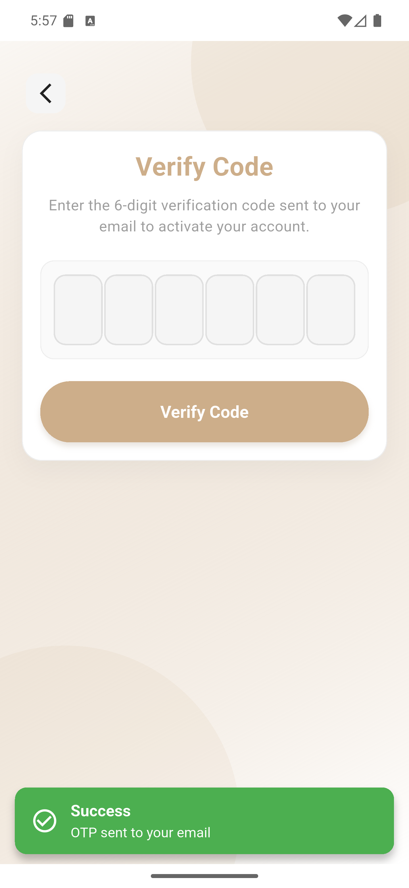
</p>

<p align="center">
  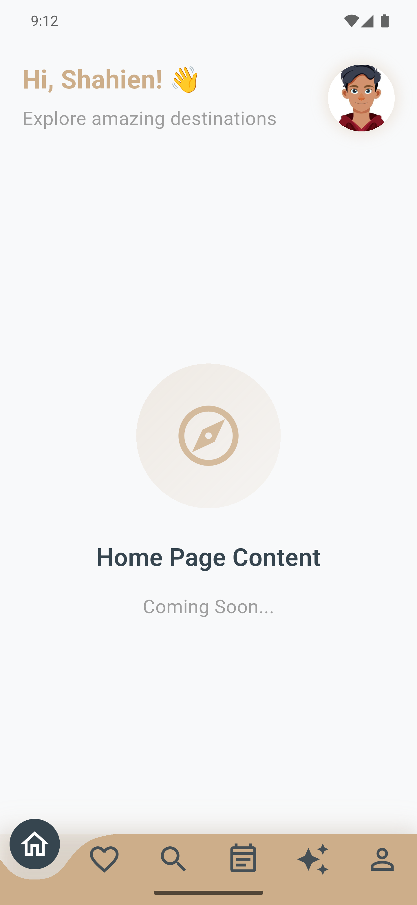
  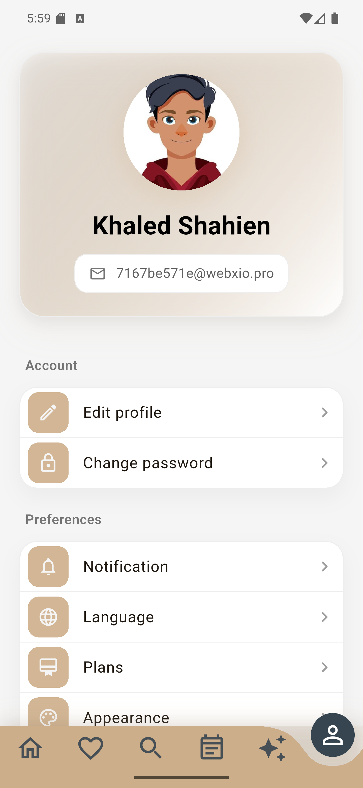
  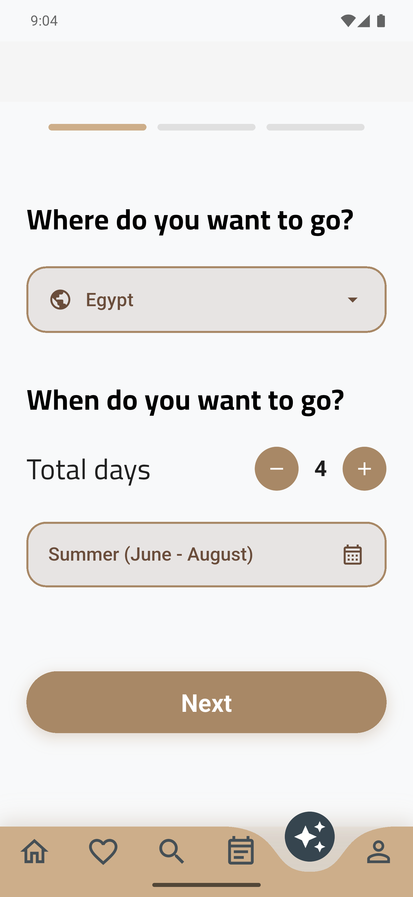
  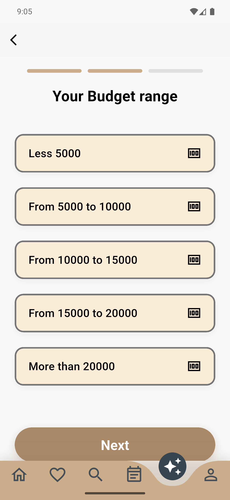
</p>

<p align="center">
  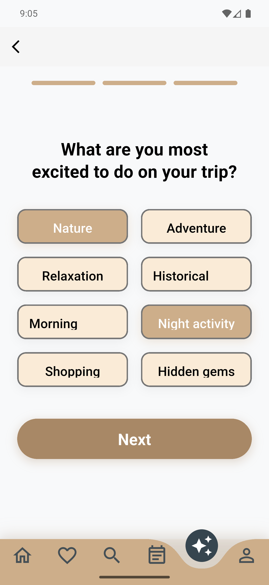
  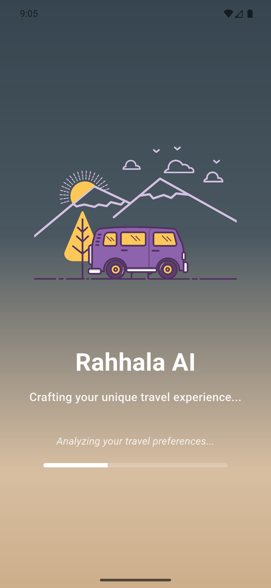
</p>

## Implemented Features

### Startup, Routing, and Session

- Splash startup flow with bootstrap logic.
- Onboarding flow stored with local preferences.
- Public and protected routes using `go_router`.
- Guest entry support for the home screen.
- Secure auth token storage using `flutter_secure_storage`.
- Session hydration through `AuthSessionService` and `TokenStorage`.

### Authentication

- Welcome screen.
- Login.
- Registration.
- Forgot password.
- OTP verification.
- Reset password before login.
- Change/reset password while logged in.
- Route guards for protected screens.

### Home and Places

- Home discovery feed from the backend.
- Place cards with cached network images.
- Place details page.
- Ratings and review summaries.
- Add, edit, and delete reviews.
- Favourites screen and favourite/unfavourite actions.

### Nearby Places

- Location permission flow.
- GPS-based nearby place loading using `geolocator`.
- Nearby places list.
- Map support through `flutter_map` and `latlong2`.
- Guest restrictions for location-dependent flows.

### AI Trip Recommendation

- Multi-step AI trip wizard.
- Trip info, budget range, and interests selection.
- Trip option fallback from `assets/config/trip_options.json`.
- Gemini-backed trip generation.
- Save trip endpoint integration.
- Regenerate trip endpoint integration.
- Trip details screen with day-by-day itinerary.
- Route/navigation service integration.
- Voice guidance support through `flutter_tts`.

### Custom Trip Planner

- Custom trip splash/loading screen.
- Custom trip input flow.
- Backend integration for generating a specific plan.
- Domain entities and models for activities, transportation, days, and trip data.

### Trip History

- My trips endpoint integration.
- Trip history list.
- Trip history details screen.

### Image Search

- Camera/gallery image acquisition.
- Image upload search endpoint.
- Image search results screen.
- Search bar entry point from the home screen.

### Chatbot

- Floating ANIS assistant entry from the main shell.
- Chat screen with bubbles, input field, and typing indicator.
- Send message and stream message use cases.
- Chat context create, update, get, and discard flows.
- Separate Dio client for chatbot backend.

### Profile and Settings

- Profile screen.
- Edit profile screen.
- Profile photo picking and upload.
- Language picker for Arabic and English.
- Light/dark theme persistence.
- Logout/session cleanup.

### Localization and Theming

- Generated Flutter localization files in `lib/l10n/generated`.
- Arabic and English ARB files in `lib/l10n`.
- Cairo font family.
- Material-style light and dark themes.
- Persistent locale and theme controllers.

### Observability

- Logger wrapper through `logger`.
- Optional Firebase Analytics service.
- Optional Firebase Crashlytics service.
- Analytics and crash reporting are disabled by default and can be enabled with build flags.

## Not Implemented Yet

The following items are not currently part of the app, or are only partially present:

- Subscriptions, premium paywalls, and in-app purchases.
- Ads or rewarded-ad flows.
- Offline trip downloads and offline navigation.
- Full social login SDK integration.
- Push/local notification pipeline.
- Full CI/CD pipeline in the repository.

## Technology Stack

- Flutter
- Dart `>=3.3.0 <4.0.0`
- Material UI
- `flutter_bloc` for Cubit/BLoC state management
- `get_it` for dependency injection
- `go_router` for routing
- `dio` for HTTP calls
- `flutter_secure_storage` and `shared_preferences` for storage
- `flutter_localizations` and ARB files for localization
- `flutter_screenutil` for responsive sizing
- `flutter_map`, `latlong2`, and `geolocator` for maps/location
- `camera`, `image_picker`, and `photo_manager` for image capture/selection
- `cached_network_image` and `shimmer` for image/loading UX
- `flutter_tts` for trip navigation voice prompts
- Firebase Analytics and Crashlytics as optional services

## Architecture

The project uses a feature-first structure with shared infrastructure under `core`.

```text
lib/
  main.dart
  core/
    analytics/
    auth/
    components/
    constants/
    crash/
    di/
    errors/
    localization/
    logging/
    network/
    routing/
    services/
    startup/
    theme/
    utils/
    widgets/
  features/
    ai_recommendation/
    auth/
    chatbot/
    custom_trip/
    home/
    image_search/
    navigation/
    nearby/
    onboarding/
    profile/
    splash/
    trip_history/
    trip_type_selection/
```

Most feature modules follow this shape where needed:

```text
feature/
  data/
    models/
    repositories/
    sources/
  domain/
    entities/
    repositories/
    usecases/
    cubits/
  presentation/
    pages/
    widgets/
    cubit/
```

## App Flow

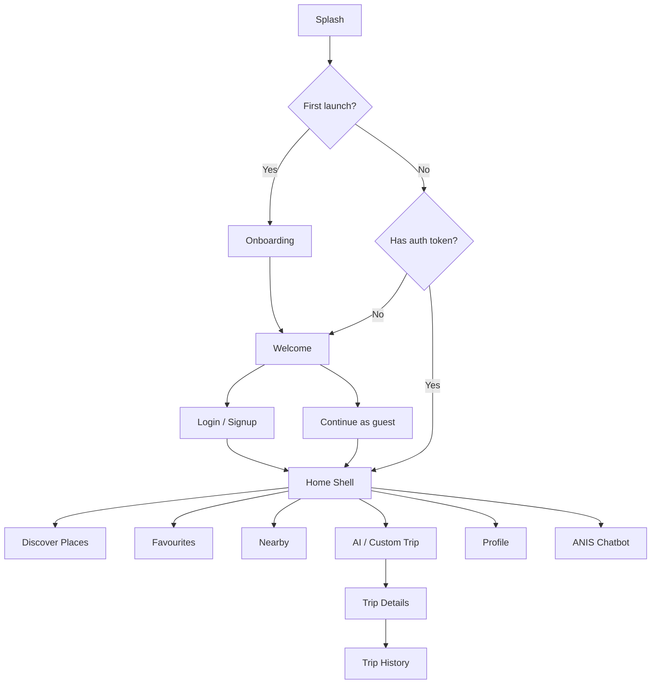

## API Integration

The app currently talks to two backend services:

- Main backend: auth, profile, home, places, favourites, AI trips, trip history, nearby places, image search, and activity routes.
- Chatbot backend: chat messages and chat context management.

Important endpoint groups are centralized in `lib/core/network/end_points.dart`.

## Assets

Configured asset folders:

```yaml
assets:
  - assets/images/
  - assets/animations/
  - assets/config/
```

Main asset groups:

- `assets/images/` for logos, illustrations, icons, and empty states.
- `assets/animations/` for Lottie animation files.
- `assets/config/trip_options.json` for local AI trip option fallback.
- `assets/screenshots/` for README screenshots.
- `assets/fonts/` for Cairo and Aldhabi font files.

## Getting Started

### Prerequisites

- Flutter SDK compatible with Dart `>=3.3.0 <4.0.0`
- Android Studio or Visual Studio Code with Flutter/Dart plugins
- Android SDK for Android builds
- Xcode for iOS builds on macOS

### Install Dependencies

```bash
flutter pub get
```

### Run the App

The project has `production` as the default Flutter flavor:

```bash
flutter run
```

To run a specific flavor:

```bash
flutter run --flavor development --dart-define=APP_FLAVOR=development
flutter run --flavor staging --dart-define=APP_FLAVOR=staging
flutter run --flavor production --dart-define=APP_FLAVOR=production
```

### Useful Build Flags

```bash
--dart-define=DEBUG_MODE=true
--dart-define=ENABLE_LOGGING=true
--dart-define=ENABLE_ANALYTICS=true
--dart-define=ENABLE_CRASH_REPORTING=true
```

Defaults:

- `DEBUG_MODE=false`
- `ENABLE_LOGGING=true`
- `ENABLE_ANALYTICS=false`
- `ENABLE_CRASH_REPORTING=false`

## Development Commands

```bash
# Analyze code
flutter analyze

# Run tests
flutter test

# Run tests with coverage
flutter test --coverage

# Format code
dart format .

# Regenerate localization files if ARB files change
flutter gen-l10n
```

## Build Commands

```bash
# Android APK
flutter build apk --release --flavor production --dart-define=APP_FLAVOR=production

# Android App Bundle
flutter build appbundle --release --flavor production --dart-define=APP_FLAVOR=production

# Web
flutter build web --release --dart-define=APP_FLAVOR=production

# Windows
flutter build windows --release --dart-define=APP_FLAVOR=production
```

Release signing can be configured with a `key.properties` file. If release signing values are not present, the Android Gradle setup falls back to debug signing for local release builds.

## Tests

The repository includes unit and integration-style tests for several areas:

- Startup/bootstrap behavior.
- Auth Cubits and post-login session handling.
- Profile and edit profile Cubits.
- AI trip navigation Cubit.
- Image search Cubit.
- Chatbot and Gemini endpoint verification files.

Run all tests with:

```bash
flutter test
```

## Current Development Notes

- The app is usable as a travel discovery and planning prototype with real backend integrations.
- Some heavy screens still contain mixed UI and orchestration logic and can be refactored later.
- Route guards and secure token storage are already in place.
- Localization and theme switching are functional.
- Monetization, ads, offline mode, and push notifications are future work rather than current features.

---

Made with Flutter.
